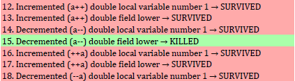
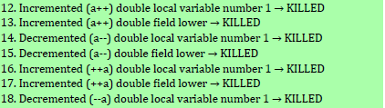
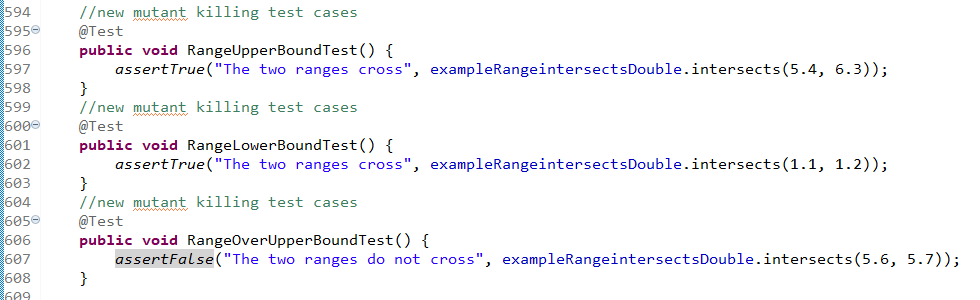
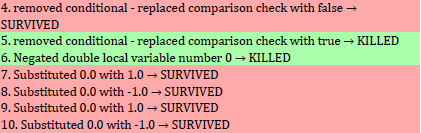
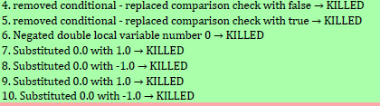
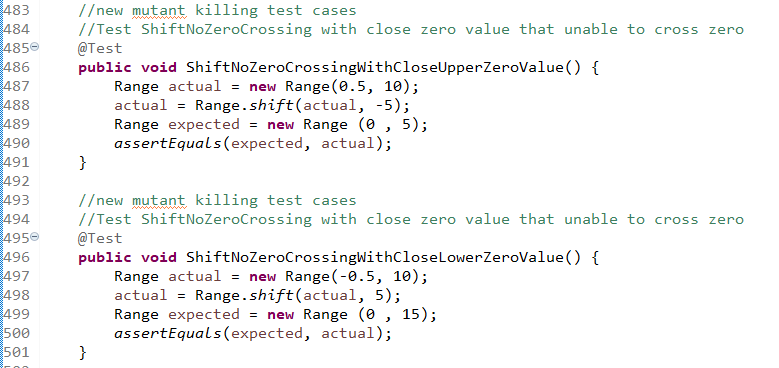
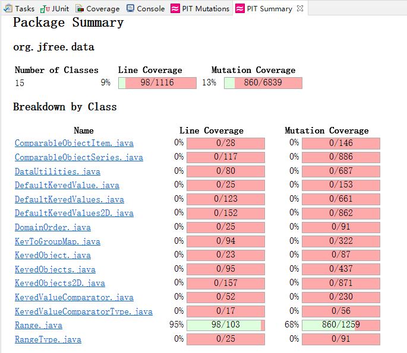
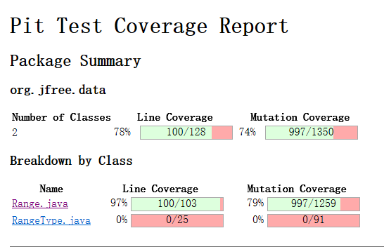

**SENG 438 - Software Testing, Reliability, and Quality**

**Lab. Report \#4 – Mutation Testing and Web app testing**

| Group \#:      | 9          |
| -------------- | ---------- |
| Student Names: | Brian Chen |
|                | Zheng Chen |
|                | Rui Guan   |
|                | Weitao Wu  |

# Introduction

# Analysis of 10 Mutants of the Range class

For Range.java line 157 ( intersects(double, double) )

 

Mutant at line 12, 13, 14，16, 17, 18 are killed by the three added tests:

The purpose of adding (1.1, 1.2) test case is to make b0 and b1 not be able to pass incremented lower value ( 1.1++ and ++1.1 to 2.1) at line 157 and 158 ( 1.1<2.1 and 1.2<2.1 ).

The purpose of adding (5.4, 6.3) test case is to make incremented b0 value ( 5.4++ and ++5.4 to 6.4) not be able to pass upper value ( 6.4>5.5 ) at line 157 and 158.

The purpose of adding (5.6, 5.7) test case is to make decremented b0 value ( 5.6-- and --5.6 to 4.6) be able to pass upper value ( 4.6<5.5 ) at line 161.

For Range.java line 387 ( shiftWithNoZeroCrossing(double, double) )

 

Mutant at line 4, 7, 8, 9, 10 are killed by the two added tests:

The purpose of adding Range(0.5, 10) and Range(-0.5, 10) is to make test cases fail when 0.0 value is substituted with 1.0 or -1.0 because 0.5 and -0.5 are not able to pass the new value. Since this method is not able to cross zero, mutant at line 4 will be killed by two added tests because if condition is replaced by 'False', the output will cross the zero.

# Report all the statistics and the mutation score for each test class

DataUtilityTest:

RangeTest:

After Mutants Killing:

# Analysis drawn on the effectiveness of each of the test classes

The modified RangeTest now provide 80% mutarion coverage as it used to have a 68% coverage. The test case for Range class now have a high effectiveness since the survived mutants are mostly equavalent mutants or senseless to kill ( such as a++, a-- for the return value ). The test suite now has a higher effectiveness on boundary value testing since most mutants killed are from variable replacement mutation.

The original DataUtilityTest had 92% of mutation coverage which means that it had a high effectiveness. Based on the study on the pitest report, most of the remained suvived mutants are equivalent mutants. After modifying the test, the score still remains 92% because the equivalent mutants cannot be killed.

# A discussion on the effect of equivalent mutants on mutation score accuracy

Equivalent mutants are functionally identical to the original class although syntactically different. Their exsitence does not mean that there are some functionalities of classes that we have not tested. The way to detect the equivalent mutants is to check if the mutant does the same functionality as the original class does. The comparison statement can easily generate the equivalent mutants. For example, "!=" can generate mutants of "less or equal" and "greater or equal". "Return true" can be replaced by "return -1".

Benefits: Equivalent mutants cannot simulate bugs. Finding the equivalent mutants can make us focus more on the non-equivalent mutants which are significant to help us find the errors and bugs.

Disavantages:They will decrease the accuracy of mutation score because there might be a lot of equivalent mutants generated.

# A discussion of what could have been done to improve the mutation score of the test suites

DataUtilityTest:

In the original test file, the test cases had 92% mutation coverage. According to the pitest report, the mutants that were not killed by the test cases were equivalent mutants except two mutants. These two mutants are both "removed call to org/jfree/chart/util/ParamChecks::nullNotPermitted", which are unacceptable. They mean that the null parameters are not tested in our previous test cases. Therefore, adding two new test cases: testNullValue2DcalculateRowTotal() and testNullKeyedValueGetCumulativePercentages() can help kill those two mutants. Since the rest mutants were equivalent mutants and could not be killed, the mutant score will remain 92%.

RangeTest:
According to the pitest report, the non-equavalent mutants are mostly from variable replacement (intersects, shiftWithNoZeroCrossing, min, max, etc) and uncovered functionality testing (hashcode). In order to kill variable replacement mutants, adding boundary value testing is highly effective as described above. Those mutant will be killed since they can no longer pass the new added test cases. For the hashcode, the previous test case compares two Range classes' hashcode that the mutants can survive since it compares both 'wrong' results. In our new added test case, the hashcode() output is compared with an actual result that the mutants of replacing variables and operators will be killed. The mutation score increase 12% from 68% to 80%.

# Why do we need mutation testing? Advantages and disadvantages of mutation testing

Advantages: Mutant testing can help us detect more bugs and error from the code. Plus, it can help us increase the coverage of our tests. After mutant testing, we can get a more stable and realiable system.

Disavantages: Using mutant testing takes a lot of time and CPU of our computers. Some mutants are too complex for us to find a bug.

# Explain your SELENUIM test case design process

We chose 8 functionalities (2 per member) from the BestBuy.ca/en-ca website

Best Buy:

Search: this was tested by using and valid search item and an invalid search item to see if we could achieve the expected results

Sort By: this was tested by searching a valid item, then creating test cases to see if each sort option achieved the expected results

Edit Personal File:

Add Items to Cart:

Sign in: this was tested by using the valid email and password and also the invalid email and password. If successfully sign in, the test will check if there is a greeting sentence for the account holder. If fail to sign in, the test will check if there is an error message.

create account: this was tested by using the name, email, and password to see if the account can be created.

# Explain the use of assertions and checkpoints

The use of assertions and checkpoints is to check if the test works as expected. They help the testers understand if tests have passed or failed.

Failed Sign In with Invalid Email/Password: add the assert text at the end of failed sign in test. It can help us check if the error message shows up and understand if the test meets our expectations.

Valid Sign In: add the assert text at the end of sign in test. As we correctly signed in, the web page will direct to the account page with a greeting message. Checking if there is a greeting message can help us check if the account page shows up and understand if the test meets our expectations.

CreateAccount: After creating the account, the web will direct to the account home page. However, in the test, we don't need any checkpoints because we cannot repeat the test since the account has been created.

# how did you test each functionaity with different test data

# Discuss advantages and disadvantages of Selenium vs. Sikulix

# How the team work/effort was divided and managed

# Difficulties encountered, challenges overcome, and lessons learned

# Comments/feedback on the lab itself
