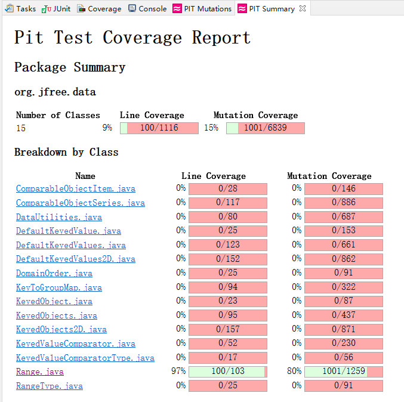

**SENG 438 - Software Testing, Reliability, and Quality**

**Lab. Report \#4 – Mutation Testing and Web app testing**

| Group \#:      | 9          |
| -------------- | ---------- |
| Student Names: | Brian Chen |
|                | Zheng Chen |
|                | Rui Guan   |
|                | Weitao Wu  |

# Introduction

# Analysis of 10 Mutants of the Range class

For Range.java line 157 ( intersects(double, double) )

 

Mutant at line 12, 13, 14，16, 17, 18 are killed by the three added tests:

The purpose of adding (1.1, 1.2) test case is to make b0 and b1 not be able to pass incremented lower value ( 1.1++ and ++1.1 to 2.1) at line 157 and 158 ( 1.1<2.1 and 1.2<2.1 ).

The purpose of adding (5.4, 6.3) test case is to make incremented b0 value ( 5.4++ and ++5.4 to 6.4) not be able to pass upper value ( 6.4>5.5 ) at line 157 and 158.

The purpose of adding (5.6, 5.7) test case is to make decremented b0 value ( 5.6-- and --5.6 to 4.6) be able to pass upper value ( 4.6<5.5 ) at line 161.

For Range.java line 387 ( shiftWithNoZeroCrossing(double, double) )

 

Mutant at line 4, 7, 8, 9, 10 are killed by the two added tests:

The purpose of adding Range(0.5, 10) and Range(-0.5, 10) is to make test cases fail when 0.0 value is substituted with 1.0 or -1.0 because 0.5 and -0.5 are not able to pass the new value. Since this method is not able to cross zero, mutant at line 4 will be killed by two added tests because if condition is replaced by 'False', the output will cross the zero.

# Report all the statistics and the mutation score for each test class

DataUtilityTest:

RangeTest:

After Mutants Killing:

# Analysis drawn on the effectiveness of each of the test classes

The modified RangeTest now provide 80% mutarion coverage as it used to have a 68% coverage. The test case for Range class now have a high effectiveness since the survived mutants are mostly equavalent mutants or senseless to kill ( such as a++, a-- for the return value ). The test suite now has a higher effectiveness on boundary value testing since most mutants killed are from variable replacement mutation.

The original DataUtilityTest had 92% of mutation coverage which means that it had a high effectiveness. Based on the study on the pitest report, most of the remained suvived mutants are equivalent mutants. After modifying the test, the score still remains 92% because the equivalent mutants cannot be killed.

# A discussion on the effect of equivalent mutants on mutation score accuracy

Equivalent mutants are functionally identical to the original class although syntactically different. Their exsitence does not mean that there are some functionalities of classes that we have not tested. The way to detect the equivalent mutants is to check if the mutant does the same functionality as the original class does. The comparison statement can easily generate the equivalent mutants. For example, "!=" can generate mutants of "less or equal" and "greater or equal". "Return true" can be replaced by "return -1".

Benefits: Equivalent mutants cannot simulate bugs. Finding the equivalent mutants can make us focus more on the non-equivalent mutants which are significant to help us find the errors and bugs.

Disavantages:They will decrease the accuracy of mutation score because there might be a lot of equivalent mutants generated.

# A discussion of what could have been done to improve the mutation score of the test suites

DataUtilityTest:

In the original test file, the test cases had 92% mutation coverage. According to the pitest report, the mutants that were not killed by the test cases were equivalent mutants except two mutants. These two mutants are both "removed call to org/jfree/chart/util/ParamChecks::nullNotPermitted", which are unacceptable. They mean that the null parameters are not tested in our previous test cases. Therefore, adding two new test cases: testNullValue2DcalculateRowTotal() and testNullKeyedValueGetCumulativePercentages() can help kill those two mutants. Since the rest mutants were equivalent mutants and could not be killed, the mutant score will remain 92%.

RangeTest:
According to the pitest report, the non-equavalent mutants are mostly from variable replacement (intersects, shiftWithNoZeroCrossing, min, max, etc) and uncovered functionality testing (hashcode). In order to kill variable replacement mutants, adding boundary value testing is highly effective as described above. Those mutant will be killed since they can no longer pass the new added test cases. For the hashcode, the previous test case compares two Range classes' hashcode that the mutants can survive since it compares both 'wrong' results. In our new added test case, the hashcode() output is compared with an actual result that the mutants of replacing variables and operators will be killed. The mutation score increase 12% from 68% to 80%.

# Why do we need mutation testing? Advantages and disadvantages of mutation testing

Advantages: Mutant testing can help us detect more bugs and error from the code. Plus, it can help us increase the coverage of our tests. After mutant testing, we can get a more stable and realiable system.

Disavantages: Using mutant testing takes a lot of time and CPU of our computers. Some mutants are too complex for us to find a bug.

# Explain your SELENUIM test case design process

We chose 8 functionalities (2 per member) from the BestBuy.ca/en-ca website

Best Buy:

Search: this was tested by using and valid search item and an invalid search item to see if we could achieve the expected results

Sort By: this was tested by searching a valid item, then creating test cases to see if each sort option achieved the expected results

Edit Personal File: this was tested by user name changing, valid email address changing, invalid email address changing, same email input, valid password changing, invalid password changing, same password input, wrong confirm password. If successfully change the personal information, the test will check if there is an alert for the account holder. If fail to edit, the test will check if there is an error message.

Add Items to Cart: this was tested by items with single version and multiple versions. If successfully add into the cart, the test will check if there is an alert for the account holder. If fail to add, the test will check if there is an error message.

Filter: this was tested by properties selected by customers, such as selecting availibility, selecting current offer, selecting customer rating, selecting discount, selecting valid price, selecting invalid price, selecting sellers, selecting status, and making multiple selections. If successfully make selection, the test will check if there is a bubble shown on the product page. If fail to select, the test will check if there is an error message.

Sign in: this was tested by using the valid email and password and also the invalid email and password. If successfully sign in, the test will check if there is a greeting sentence for the account holder. If fail to sign in, the test will check if there is an error message.

create account: this was tested by using the name, email, and password to see if the account can be created.

Choose Brand: this was tested by choosing a brand to see if the correct brand page shows up. Since this functionality couldn't fail, the test was designed to test in two ways: choose a popular brand and choose a brand with its first letter of its name.

# Explain the use of assertions and checkpoints

The use of assertions and checkpoints is to check if the test works as expected. They help the testers understand if tests have passed or failed.

Search Invalid: assert text was used to check if the unknown product page would be displayed given an invalid query, and in this case we would be expecting "Sorry, we couldn't find anything for"

Search valid: assert text was used again but this time to check if the headphones products page was displayed by checking for the word "Headphones" in the title

Sort by: since the sort options came from a drop down menu, we used verify element present and then checked for each specific value of either "Price Low-High", "Price High-Low", "Best Match", or "Highest Rated" to see if that specific option in the drop down menu was selected.

Failed Sign In with Invalid Email/Password: add the assert text at the end of failed sign in test. It can help us check if the error message shows up and understand if the test meets our expectations.

Valid Sign In: add the assert text at the end of sign in test. As we correctly signed in, the web page will direct to the account page with a greeting message. Checking if there is a greeting message can help us check if the account page shows up and understand if the test meets our expectations.

CreateAccount: After creating the account, the web will direct to the account home page. However, in the test, we don't need any checkpoints because we cannot repeat the test since the account has been created.

Choose Brand: After choosing a brand, the web will direct to the brand page with the brand name. Using the assert text to check if the brand name matches the brand that we choose for testing.

Filter: After selecting the filter, it will present a lable on the product page. Using "assert element on present" to check if the present lable is the same as what you selected.

Edit Personal Info: After editing info successfully, it will have an alert. If editing failed, it will have an error message. Using "assert text" to check if the text is "edit successfully" or "something error".

Add Item into Cart: After adding item into cart successfully, it will have an alert. If not, it will have an error message. Using "assert text" to check if the text is "add successfully" or "something error".

# how did you test each functionaity with different test data

Sign In: We designed to test sign in functionality in two ways with correct account and wrong email/password. First, test sign in with the correct email and password. Then, test sign in with wrong email/password to see if we could sign in successfully.

createAccount: Even though we use an inexistent email to create account, the account will still be created. Therefore, we designed to test create account functionality with name, email, and password to see if the account can be created.

Choose brand: We can choose brands in two ways on BestBuy website: choose the popular brand and choose brand based on the first letter of the brand name. Therefore, the test will test in these two ways.

Filter: We can try to select element in different list. Every kind of selection is one test case. And we also made a test case for the multiple choices in different list.

Edit personal info: We made test cases for every different information: one test case for the name editing; for the email editing, there are both valid and invalid input; for the password, there is another test case for the different confirm password.

Add item into cart: We made two test case: one for the item with single version, and one for the item with multiple version. The multiple verison item needs to be selected the property you would like.

Search: We designed the search functionality tests by making sure that a valid search option could be tested as well as a invalid search query and by doing so, covering essentially the two main results that could appear.

Sort By: We designed the Sort functionality tests to include all options that could appear when selecting one of the options from the drop down Sort menu. By doing so, this would cover each option and response the webpage could offer when automating the tests.

# Discuss advantages and disadvantages of Selenium vs. Sikulix

Selenium:

Advantages: open source software, support different systems and different browers, help testers easily test the GUI, support different programming language

Disadvantages: only supports web based application and does not support windows based application, difficult to test image based application

Sikulix:

Advantages: open source, has library functions like click, find and the input parameters are Images, can automate the GUI using screenshots

Disadvantages: scripting is platform dependent, resolution dependent, can only run mutiple scripts one by one

# How the team work/effort was divided and managed

For Part I, Brian and Weitao worked on developing the test cases to in crease the mutation score for DataUtility class, Rui and Zheng worked on the Range class. For part II, each group member worked on two functionalities of the Best Buy web page.

# Difficulties encountered, challenges overcome, and lessons learned

The pit mutation testing on eclipse has a long running and report generating time, thus, we had a long time to verify our new added test cases. Pit Mutation also has a large CPU usage while running. The generated report need sometime to understand its naming (the report uses variable 1,2,3 etc.) and mutation's impact on the method. Mutation testing tells us another aspect of test cases improvement and lead us better understanding on fault-based testing.

It is a little bit confusing at first using Selenium but the instructions from lecture notes are clear and helpful to follow. The script sometimes get stuck due to Chrome or Internet problem but all our test cases run normally at last. GUI testing experience from this lab is able to be carried to other courses' testing.

# Comments/feedback on the lab itself

The lab provided a great chance for us to practise the use of mutation test and GUI testing. The lab overall is great.
